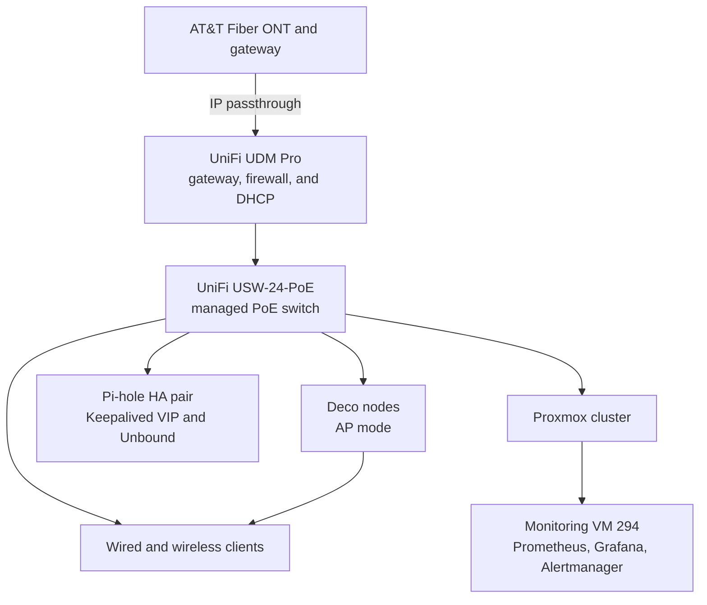

# Current Topology: UniFi (flat LAN)

The UDM Pro and USW-24-PoE have been the network core since the
2026-09-27 equivalent-state cutover. Deco nodes remain access points. The LAN
is still flat; VLAN segmentation and inter-VLAN firewall policy are planned.
The [Phase 1 diagrams](../docs/phase-1-managed-network-cutover/diagrams.md)
record the earlier ER605 and Omada network.

The UDM Pro supplies DHCP, with the Pi-hole VIP as client DNS. The
2026-09-27 cutover kept the same gateway and DNS behavior; it did not
introduce segmentation.
